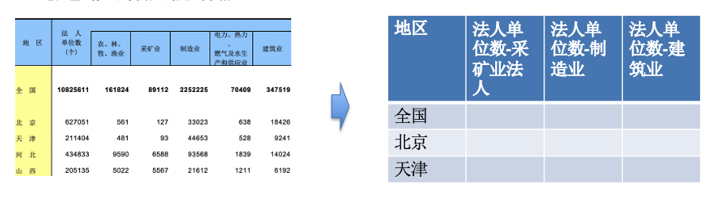

# excel_reader_for_complex_header
excel reader which contains complex header, it convert multi dimension header to two-dimension



-----
## usage
```
from cmp_reader import read_excel
excel_file = "contain_complex_header_excel.xls"
excel_data = read_excel(excel_file)

# excel col headers
excel_data.keys()
```

## next version
+ support index col (which like pandas.read_excel(index_col))
+ more hight search  performance
+ support read all sheet
+ support separator for link row col headers